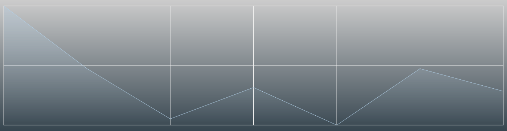

<div align="center">
  <h1>
    <b>Licha</b>
  </h1>
  <p>
    Licha это JavaScript проект, который поможет вам создать линейную диаграмму
  </p>
</div>

* [Использование](https://github.com/Alexandr-web/Licha#использование)
* [Параметры](https://github.com/Alexandr-web/Licha#параметры)
* [Утилиты](https://github.com/Alexandr-web/Licha#утилиты)
* [Работы](https://github.com/Alexandr-web/Licha/blob/master/.github/works/readme.md)

## Использование

Как использовать этот инструмент?

```js
import { Licha, Utils, } from "./dist/Licha.js";

const utils = new Utils();

new Licha({
    theme: utils.getTheme(0, "light"),
    padding: 10,
    selectorCanvas: "canvas",
    background: [utils.getColor("bistre"), utils.getColor("charcoal")],
    grid: { line: { width: 1, }, },
    data: {
        "Group 1": {
            data: [
                { name: "Понедельник", value: 100_000, },
                { name: "Вторник", value: 50_000, },
                { name: "Среда", value: 10_000, },
                { name: "Четверг", value: 35_000, },
                { name: "Пятница", value: 5000, },
                { name: "Суббота", value: 50_000, },
                { name: "Воскресенье", value: 32_000, }
            ],
        },
    },
}).init();
```

### Результат



## Параметры

Параметры, которые принимает конструктор класса Licha

* [selectorCanvas](https://github.com/Alexandr-web/Licha#selectorcanvas)
* [fontFamily](https://github.com/Alexandr-web/Licha#fontfamily)
* [background](https://github.com/Alexandr-web/Licha#background)
* [padding](https://github.com/Alexandr-web/Licha#padding)
* [type](https://github.com/Alexandr-web/Licha#type)
* [title](https://github.com/Alexandr-web/Licha#title)
* [axisY](https://github.com/Alexandr-web/Licha#axisy)
* [axisX](https://github.com/Alexandr-web/Licha#axisx)
* [line](https://github.com/Alexandr-web/Licha#line)
* [cap](https://github.com/Alexandr-web/Licha#cap)
* [grid](https://github.com/Alexandr-web/Licha#grid)
* [legend](https://github.com/Alexandr-web/Licha#legend)
* [blockInfo](https://github.com/Alexandr-web/Licha#blockinfo)
* [data](https://github.com/Alexandr-web/Licha#data)
* [theme](https://github.com/Alexandr-web/Licha#theme)

### `selectorCanvas`

| Описание | Пример | Тип |
| ------------- | ------------- | ------------- |
| Принимает селектор элемента холста | `selectorCanvas: ".my-chart"` | `string` |

### `fontFamily`

| Описание | Пример | Тип |
| ------------- | ------------- | ------------- |
| Устанавливает семейство шрифтов (по умолчанию Arial). Убедитесь, что этот шрифт установлен на вашем компьютере и подключен к сайту | `fontFamily: "Montserrat"` | `string` |

### `background`

| Описание | Пример | Тип |
| ------------- | ------------- | ------------- |
| Задний фон диаграммы | `background: "#ffffff"` | `array<string> \| string` |

### `padding`

| Описание | Пример | Тип |
| ------------- | ------------- | ------------- |
| Принимает объект внутренних отступов для диаграммы или же просто число | `padding: { top: 10, right: 10, bottom: 10, ... } или 10` | `object \| number` |

#### Принимаемые параметры
  
  * #### `top`

    | Описание | Пример | Тип |
    | ------------- | ------------- | ------------- |
    | Отступ сверху | `padding: { top: 25, }` | `number` |

  * #### `right`
  
    | Описание | Пример | Тип |
    | ------------- | ------------- | ------------- |
    | Отступ справа | `padding: { right: 25, }` | `number` |
  
  * #### `bottom`
  
    | Описание | Пример | Тип |
    | ------------- | ------------- | ------------- |
    | Отступ снизу | `padding: { bottom: 25, }` | `number` |

  * #### `left`
  
    | Описание | Пример | Тип |
    | ------------- | ------------- | ------------- |
    | Отступ слева | `padding: { left: 25, }` | `number` |

### `type`

| Описание | Пример | Тип |
| ------------- | ------------- | ------------- |
| Тип диаграммы | `type: "line"` | `string` |

### `title`
| Описание | Пример | Тип |
| ------------- | ------------- | ------------- |
| Принимает параметры, связанные с заголовком диаграммы | `title: { font: { ... }, gaps: { ... }, }` | `object` |

#### Принимаемые параметры

  * #### `place`

    | Описание | Пример | Тип |
    | ------------- | ------------- | ------------- |
    | Позиция заголовка ("left", "center", "right") | `title: { place: "right", }` | `string` |

  * #### `font`

    | Описание | Пример | Тип |
    | ------------- | ------------- | ------------- |
    | Принимает объект данных, связанный со шрифтом и текстом | `title: { font: { size: 16, color: "white", ... }, }` | `object` |

    ##### Принимаемые параметры

    * ##### `text`

      | Описание | Пример | Тип |
      | ------------- | ------------- | ------------- |
      | Текст заголовка | `title: { font: { text: "Моя диаграмма!", }, }` | `string` |

    * ##### `size`
    
      | Описание | Пример | Тип |
      | ------------- | ------------- | ------------- |
      | Размер шрифта | `title: { font: { size: 18, }, }` | `number` |

    * ##### `color`
  
      | Описание | Пример | Тип |
      | ------------- | ------------- | ------------- |
      | Цвет шрифта | `title: { font: { color: "black", }, }` | `string` |

    * ##### `weight`
  
      | Описание | Пример | Тип |
      | ------------- | ------------- | ------------- |
      | Жирность шрифта | `title: { font: { weight: 400, }, }` | `number` |


  * #### `gaps`

    | Описание | Пример | Тип |
    | ------------- | ------------- | ------------- |
    | Содержит отступы заголовка | `title: { gaps: { bottom: 15, }, }` | `object` |

    ##### Принимаемые параметры

    * ##### `bottom`

      | Описание | Пример | Тип |
      | ------------- | ------------- | ------------- |
      | Нижний отступ | `title: { gaps: { bottom: 15, }, }` | `number` |

### `axisY`

| Описание | Пример | Тип |
| ------------- | ------------- | ------------- |
| Принимает параметры, связанные с ординатой диаграммы | `axisY: { font: { ... }, step: 3, ... }` | `object` |

#### Принимаемые параметры

  * #### `place`

    | Описание | Пример | Тип |
    | ------------- | ------------- | ------------- |
    | Позиция ординаты ("left", "right") | `axisY: { place: "right", }` | `string` |

  * #### `font`

    | Описание | Пример | Тип |
    | ------------- | ------------- | ------------- |
    | Принимает объект данных, связанный со шрифтом и текстом в точках | `axisY: { font: { size: 16, color: "white", ... }, }` | `object` |

    ##### Принимаемые параметры

    * ##### `size`
    
      | Описание | Пример | Тип |
      | ------------- | ------------- | ------------- |
      | Размер шрифта | `axisY: { font: { size: 18, }, }` | `number` |

    * ##### `color`
  
      | Описание | Пример | Тип |
      | ------------- | ------------- | ------------- |
      | Цвет шрифта | `axisY: { font: { color: "black", }, }` | `string` |

    * ##### `weight`
  
      | Описание | Пример | Тип |
      | ------------- | ------------- | ------------- |
      | Жирность шрифта | `axisY: { font: { weight: 400, }, }` | `number` |

    * ##### `showText`
  
      | Описание | Пример | Тип |
      | ------------- | ------------- | ------------- |
      | Правило, по которому можно контролировать состояние текста на оси | `axisY: { font: { showText: false, }, }` | `boolean` |
  
  * #### `step`

    | Описание | Пример | Тип |
    | ------------- | ------------- | ------------- |
    | Шаг, с которым значения будут отрисовываться по оси ординат (По умолчанию 3) | `axisY: { step: 4, }` | `number` |

  * #### `editValue`

    | Описание | Пример | Тип |
    | ------------- | ------------- | ------------- |
    | Метод, позволяющий изменить внешний вид значения по оси ординат | `axisY: { editValue: (val) => val + "$", }` | `function: string \| number` |

  * #### `sort`

    | Описание | Пример | Тип |
    | ------------- | ------------- | ------------- |
    | Принимает значение, связанное с тем, как точки будут отображаться на оси ординат | `axisY: { sort: "less-more" }` или `axisY: { sort: "more-less" }` | `string` |

  * #### `title`

    | Описание | Пример | Тип |
    | ------------- | ------------- | ------------- |
    | Получает данные, связанные с заголовком | `axisY: { title: { font: { ... }, ... } }` | `object` |

    ##### Принимаемые параметры

    * ##### `font`

      | Описание | Пример | Тип |
      | ------------- | ------------- | ------------- |
      | Принимает объект данных, связанный со шрифтом и текстом заголовка | `axisY: { title: { font: { size: 16, color: "white", ... }, }, }` | `object` |

      ##### Принимаемые параметры

      * ##### `text`

        | Описание | Пример | Тип |
        | ------------- | ------------- | ------------- |
        | Текст заголовка | `axisY: { title: { font: { text: "Моя диаграмма!", }, }, }` | `string` |

      * ##### `size`
    
        | Описание | Пример | Тип |
        | ------------- | ------------- | ------------- |
        | Размер шрифта | `axisY: { title: { font: { size: 18, }, }, }` | `number` |

      * ##### `color`
  
        | Описание | Пример | Тип |
        | ------------- | ------------- | ------------- |
        | Цвет шрифта | `axisY: { title: { font: { color: "black", }, }, }` | `string` |

      * ##### `weight`
  
        | Описание | Пример | Тип |
        | ------------- | ------------- | ------------- |
        | Жирность шрифта | `axisY: { title: { font: { weight: 400, }, }, }` | `number` |

    * #### `gaps`

      | Описание | Пример | Тип |
      | ------------- | ------------- | ------------- |
      | Отступы заголовка | `axisY: { title: { gaps: { right: 15, }, }, }` | `object` |

    ##### Принимаемые параметры

      * ##### `right`

        | Описание | Пример | Тип |
        | ------------- | ------------- | ------------- |
        | Правый отступ | `axisY: { title: { gaps: { right: 15, }, }, }` | `number` |

### `axisX`
| Описание | Пример | Тип |
| ------------- | ------------- | ------------- |
| Принимает данные, связанные с абсциссой диаграммы | `axisX: { font: { ... }, ... }` | `object` |

#### Принимаемые параметры

  * #### `rotate`

    | Описание | Пример | Тип |
    | ------------- | ------------- | ------------- |
    | Переворачивает названия точек на 90 градусов | `axisX: { rotate: true, }` | `boolean` |

  * #### `place`

    | Описание | Пример | Тип |
    | ------------- | ------------- | ------------- |
    | Позиция оси абсцисс ("top" или "bottom") | `axisX: { place: "top", }` | `string` |

  * #### `font`

    | Описание | Пример | Тип |
    | ------------- | ------------- | ------------- |
    | Принимает объект данных, связанный со шрифтом и текстом в точках | `axisX: { font: { size: 16, color: "white", ... }, }` | `object` |

    ##### Принимаемые параметры

    * ##### `showText`
  
      | Описание | Пример | Тип |
      | ------------- | ------------- | ------------- |
      | Правило, по которому можно контролировать состояние текста на оси абсцисс | `axisX: { font: { showText: false, }, }` | `boolean` |

    * ##### `size`
    
      | Описание | Пример | Тип |
      | ------------- | ------------- | ------------- |
      | Размер шрифта | `axisX: { font: { size: 18, }, }` | `number` |

    * ##### `color`
  
      | Описание | Пример | Тип |
      | ------------- | ------------- | ------------- |
      | Цвет шрифта | `axisX: { font: { color: "black", }, }` | `string` |

    * ##### `weight`
  
      | Описание | Пример | Тип |
      | ------------- | ------------- | ------------- |
      | Жирность шрифта | `axisX: { font: { weight: 400, }, }` | `number` |
  
  * #### `ignoreNames`

    | Описание | Пример | Тип |
    | ------------- | ------------- | ------------- |
    | Содержит имена точек оси абсцисс, которые не будут отображаться на графике | `axisX: { ignoreNames: (name, index) => index % 2 === 0, }` или `axisX: { ignoreNames: ["Понедельник", "Воскресенье"], }` | `function: boolean \| array<string\|number>` |

  * #### `editName`

    | Описание | Пример | Тип |
    | ------------- | ------------- | ------------- |
    | Метод, позволяющий изменить внешний вид названия точек на оси абсцисс. | `axisX: { editName: (name) => new Date(name).toLocaleString(), }` | `function: string \| number` |

  * #### `sort`

    | Описание | Пример | Тип |
    | ------------- | ------------- | ------------- |
    | Принимает значение, связанное с тем, как точки будут отображаться на оcи абсцисс | `axisX: { sort: "less-more" }` или `axisX: { sort: "more-less" }` | `string` |

  * #### `title`

    | Описание | Пример | Тип |
    | ------------- | ------------- | ------------- |
    | Получает данные, связанные с заголовком | `axisX: { title: { font: { ... }, ... } }` | `object` |

    ##### Принимаемые параметры

    * ##### `font`

      | Описание | Пример | Тип |
      | ------------- | ------------- | ------------- |
      | Принимает объект данных, связанный со шрифтом и текстом в заголовке | `axisX: { title: { font: { size: 16, color: "white", ... }, }, }` | `object` |

      ##### Принимаемые параметры

      * ##### `text`

        | Описание | Пример | Тип |
        | ------------- | ------------- | ------------- |
        | Текст заголовка | `axisX: { title: { font: { text: "Моя диаграмма!", }, }, }` | `string` |

      * ##### `size`
    
        | Описание | Пример | Тип |
        | ------------- | ------------- | ------------- |
        | Размер шрифта | `axisX: { title: { font: { size: 18, }, }, }` | `number` |

      * ##### `color`
  
        | Описание | Пример | Тип |
        | ------------- | ------------- | ------------- |
        | Цвет шрифта | `axisX: { title: { font: { color: "black", }, }, }` | `string` |

      * ##### `weight`
  
        | Описание | Пример | Тип |
        | ------------- | ------------- | ------------- |
        | Жирность шрифта | `axisX: { title: { font: { weight: 400, }, }, }` | `number` |

    * #### `gaps`

      | Описание | Пример | Тип |
      | ------------- | ------------- | ------------- |
      | Отступы заголовка | `axisX: { title: { gaps: { top: 15, }, }, }` | `object` |

      ##### Принимаемые параметры

      * ##### `top`

        | Описание | Пример | Тип |
        | ------------- | ------------- | ------------- |
        | Врехний отступ | `axisX: { title: { gaps: { top: 15, }, }, }` | `number` |

### `line`

| Описание | Пример | Тип |
| ------------- | ------------- | ------------- |
| Принимает данные, которые относятся к каждой линии всех групп | `line: { stepped: true, width: 2, ... }` | `object` |

#### Принимаемые параметры
  
  * #### `fill`

    | Описание | Пример | Тип |
    | ------------- | ------------- | ------------- |
    | Заполнение | `line: { fill: ["rgba(255,255,255,0.4)", "transparent"], }` или `line: { fill: "white", }` | `array<string> \| string` |

  * #### `stepped`

    | Описание | Пример | Тип |
    | ------------- | ------------- | ------------- |
    | Правило, которое будет рисовать линию шаг за шагом (По умолчанию false) | `line: { stepped: true, }` | `boolean` |

  * #### `color`
  
    | Описание | Пример | Тип |
    | ------------- | ------------- | ------------- |
    | Цвет линии | `line: { color: "red", }` | `array<string> \| string` |
  
  * #### `dotted`
  
    | Описание | Пример | Тип |
    | ------------- | ------------- | ------------- |
    | Правило, согласно которому линия будет состоять из точек | `line: { dotted: true, }` | `boolean` |

  * #### `width`
  
    | Описание | Пример | Тип |
    | ------------- | ------------- | ------------- |
    | Ширина линии (По умолчанию 1) | `line: { width: 2, }` | `number` |

### `cap`

| Описание | Пример | Тип |
| ------------- | ------------- | ------------- |
| Принимает данные, применимые к каждому колпачку всех групп | `cap: { format: "circle", size: 6, ... }` | `object` |

#### Принимаемые параметры
  
  * #### `format`

    | Описание | Пример | Тип |
    | ------------- | ------------- | ------------- |
    | Формат колпачка ("square", "circle", "rhomb", "triangle") | `cap: { format: "square", }` | `string` |

  * #### `color`
  
    | Описание | Пример | Тип |
    | ------------- | ------------- | ------------- |
    | Цвет колпачка | `cap: { color: "red", }` | `array<string> \| string` |
  
  * #### `size`
  
    | Описание | Пример | Тип |
    | ------------- | ------------- | ------------- |
    | Размер колпачка | `cap: { size: 8, }` | `number` |

  * #### `stroke`
  
    | Описание | Пример | Тип |
    | ------------- | ------------- | ------------- |
    | Принимает данные, связанные с обводкой колпачка | `cap: { stroke: { width: 1, ... }, }` | `object` |

    ##### Принимаемые параметры

      * ##### `width`

        | Описание | Пример | Тип |
        | ------------- | ------------- | ------------- |
        | Ширина линии  | `cap: { stroke: { width: 2, }, }` | `number` |

      * ##### `color`
    
        | Описание | Пример | Тип |
        | ------------- | ------------- | ------------- |
        | Цвет линии | `cap: { stroke: { color: "black", } }` | `string` |

### `grid`

| Описание | Пример | Тип |
| ------------- | ------------- | ------------- |
| Принимает данные, относящиеся к сетке диаграммы | `grid: { line: { ... }, ... }` | `object` |

#### Принимаемые параметры
  
  * #### `background`

    | Описание | Пример | Тип |
    | ------------- | ------------- | ------------- |
    | Задний фон сетки | `grid: { background: "#c2c2c2", }` | `array<string> \| string` |

  * #### `format`

    | Описание | Пример | Тип |
    | ------------- | ------------- | ------------- |
    | Формат сетки ("horizontal", "vertical", "default") | `grid: { format: "vertical", }` | `string` |

  * #### `line`
  
    | Описание | Пример | Тип |
    | ------------- | ------------- | ------------- |
    | Данные линии сетки | `grid: { line: { ... }, }` | `object` |

    ##### Принимаемые параметры

      * ##### `stretch`

        | Описание | Пример | Тип |
        | ------------- | ------------- | ------------- |
        | Правило, согласно которому линии сетки будут "тянуться" до осевых точек | `grid: { line: { stretch: true, }, }` | `boolean` |

      * ##### `width`

        | Описание | Пример | Тип |
        | ------------- | ------------- | ------------- |
        | Ширина линии | `grid: { line: { width: 2, }, }` | `number` |

      * ##### `color`
    
        | Описание | Пример | Тип |
        | ------------- | ------------- | ------------- |
        | Цвет линии | `grid: { line: { color: "grey", } }` | `array<string> \| string` |

      * ##### `dotted`
    
        | Описание | Пример | Тип |
        | ------------- | ------------- | ------------- |
        | Правило, согласно которому линия будет состоять из точек | `grid: { line: { dotted: true, } }` | `boolean` |

### `legend`

| Описание | Пример | Тип |
| ------------- | ------------- | ------------- |
| Принимает данные, относящиеся к легенде диаграммы | `legend: { font: { ... }, circle: { ... }, ... }` | `object` |

#### Принимаемые параметры

  * #### `place`

    | Описание | Пример | Тип |
    | ------------- | ------------- | ------------- |
    | Позиция легенды ("left", "center", "right") | `legend: { place: "left", }` | `string` |

  * #### `events`

    | Описание | Пример | Тип |
    | ------------- | ------------- | ------------- |
    | Принимает события легенды | `legend: { events: { ... }, }` | `object` |

    ##### Принимаемые параметры

    * ##### `onClick`

      | Описание | Пример | Тип |
      | ------------- | ------------- | ------------- |
      | Вызывается при нажатии на элемент легенды | `legend: { events: { onClick() { console.log(this) }, }, }` | `function` |

  * #### `circle`

    | Описание | Пример | Тип |
    | ------------- | ------------- | ------------- |
    | Принимает объект данных, связанный с кругом элемента легенды. | `legend: { circle: { ... }, }` | `object` |

    ##### Принимаемые параметры

      * ##### `radius`
    
        | Описание | Пример | Тип |
        | ------------- | ------------- | ------------- |
        | Радиус круга | `legend: { circle: { radius: 18, }, }` | `number` |
  
  * #### `font`

    | Описание | Пример | Тип |
    | ------------- | ------------- | ------------- |
    | Принимает объект данных, связанный со шрифтом и текстом в элементах легенды | `legend: { font: { ... }, }` | `object` |

    ##### Принимаемые параметры

      * ##### `size`
    
        | Описание | Пример | Тип |
        | ------------- | ------------- | ------------- |
        | Размер шрифта | `legend: { font: { size: 18, }, }` | `number` |

      * ##### `color`
  
        | Описание | Пример | Тип |
        | ------------- | ------------- | ------------- |
        | Цвет шрифта | `legend: { font: { color: "black", }, }` | `string` |

      * ##### `weight`
  
        | Описание | Пример | Тип |
        | ------------- | ------------- | ------------- |
        | Жирность шрифта | `legend: { font: { weight: 400, }, }` | `number` |

  * #### `gaps`

    | Описание | Пример | Тип |
    | ------------- | ------------- | ------------- |
    | Принимает данные, относящиеся к отступам как элементов легенды, так и самой легенды | `legend: { gaps: { ... }, }` | `object` |

    ##### Принимаемые параметры

      * ##### `circle`
    
        | Описание | Пример | Тип |
        | ------------- | ------------- | ------------- |
        | Принимает отступы круга | `legend: { gaps: { circle: { ... }, }, }` | `object` |

        ###### Принимаемые параметры

        * ###### `right`
          
          | Описание | Пример | Тип |
          | ------------- | ------------- | ------------- |
          | Правый отступ | `legend: { gaps: { circle: { right: 5, }, }, }` | `number` |

      * ##### `group`
    
        | Описание | Пример | Тип |
        | ------------- | ------------- | ------------- |
        | Принимает отступы у названий групп | `legend: { gaps: { group: { ... }, }, }` | `object` |

        ###### Принимаемые параметры

        * ###### `right`
          
          | Описание | Пример | Тип |
          | ------------- | ------------- | ------------- |
          | Отступ справа | `legend: { gaps: { group: { right: 5, }, }, }` | `number` |

        * ###### `bottom`
          
          | Описание | Пример | Тип |
          | ------------- | ------------- | ------------- |
          | Отступ снизу | `legend: { gaps: { group: { bottom: 5, }, }, }` | `number` |

      * ##### `legend`
    
        | Описание | Пример | Тип |
        | ------------- | ------------- | ------------- |
        | Принимает отступы легенды | `legend: { gaps: { legend: { ... }, }, }` | `object` |

        ###### Принимаемые параметры

        * ###### `bottom`
          
          | Описание | Пример | Тип |
          | ------------- | ------------- | ------------- |
          | Отступ снизу | `legend: { gaps: { legend: { bottom: 5, }, }, }` | `number` |

### `blockInfo`

| Описание | Пример | Тип |
| ------------- | ------------- | ------------- |
| Принимает данные, относящиеся к окну с информацией об активной группе | `blockInfo: { ... }` | `object` |

#### Принимаемые параметры

  * #### `background`

    | Описание | Пример | Тип |
    | ------------- | ------------- | ------------- |
    | Задний фон | `blockInfo: { background: "black", }` | `array<string> \| string` |

  * #### `events`

    | Описание | Пример | Тип |
    | ------------- | ------------- | ------------- |
    | Принимает обработчики событий | `blockInfo: { events: { ... }, }` | `object` |

    ##### Принимаемые параметры

    * ##### `onAimed`

      | Описание | Пример | Тип |
      | ------------- | ------------- | ------------- |
      | Вызывается при наведении на точку | `blockInfo: { events: { onAimed() { console.log(this) }, }, }` | `function` |

  * #### `groups`

    | Описание | Пример | Тип |
    | ------------- | ------------- | ------------- |
    | Принимает данные, связанные с названиями групп | `blockInfo: { groups: { ... }, }` | `object` |

    ##### Принимаемые параметры
  
    * ##### `font`

      | Описание | Пример | Тип |
      | ------------- | ------------- | ------------- |
      | Принимает данные, связанные со шрифтом названий групп | `blockInfo: { groups: { font: { ... }, }, }` | `object` |

      ###### Принимаемые параметры

      * ###### `size`
          
        | Описание | Пример | Тип |
        | ------------- | ------------- | ------------- |
        | Размер шрифта | `blockInfo: { groups: { font: { size: 5, }, }, }` | `number` |

      * ###### `color`
          
        | Описание | Пример | Тип |
        | ------------- | ------------- | ------------- |
        | Цвет шрифта | `blockInfo: { groups: { font: { color: "white", }, }, }` | `string` |

      * ###### `weight`
          
        | Описание | Пример | Тип |
        | ------------- | ------------- | ------------- |
        | Жирность шрифта | `blockInfo: { groups: { font: { weight: 400, }, }, }` | `number` |

    * ##### `gaps`
  
      | Описание | Пример | Тип |
      | ------------- | ------------- | ------------- |
      | Отступы названий групп | `blockInfo: { padding: { right: 25, } }` | `object \| number` |

      ###### Принимаемые параметры

      * ###### `bottom`
          
        | Описание | Пример | Тип |
        | ------------- | ------------- | ------------- |
        | Нижний отступ | `blockInfo: { groups: { gaps: { bottom: 15, }, }, }` | `number` |

      * ###### `right`
          
        | Описание | Пример | Тип |
        | ------------- | ------------- | ------------- |
        | Отступ справа | `blockInfo: { groups: { gaps: { right: 15, }, }, }` | `number` |

  * #### `title`

    | Описание | Пример | Тип |
    | ------------- | ------------- | ------------- |
    | Принимает параметры, связанные с заголовком окна | `blockInfo: { title: { ... }, }` | `object` |

    ##### Принимаемые параметры
  
    * ##### `font`

      | Описание | Пример | Тип |
      | ------------- | ------------- | ------------- |
      | Принимает данные, связанные со шрифтом заголовка | `blockInfo: { title: { font: { ... }, } }` | `object` |

      ###### Принимаемые параметры

      * ###### `size`
          
        | Описание | Пример | Тип |
        | ------------- | ------------- | ------------- |
        | Размер шрифта | `blockInfo: { title: { font: { size: 5, }, }, }` | `number` |

      * ###### `color`
          
        | Описание | Пример | Тип |
        | ------------- | ------------- | ------------- |
        | Цвет шрифта | `blockInfo: { title: { font: { color: "white", }, }, }` | `string` |

      * ###### `weight`
          
        | Описание | Пример | Тип |
        | ------------- | ------------- | ------------- |
        | Жирность шрифта | `blockInfo: { title: { font: { weight: 400, }, }, }` | `number` |

    * ##### `gaps`
  
      | Описание | Пример | Тип |
      | ------------- | ------------- | ------------- |
      | Отступы заголовка | `blockInfo: { padding: { right: 25, } }` | `object \| number` |

      ###### Принимаемые параметры

      * ###### `bottom`
          
        | Описание | Пример | Тип |
        | ------------- | ------------- | ------------- |
        | Отступ снизу | `blockInfo: { title: { gaps: { bottom: 15, }, }, }` | `number` |

  * #### `padding`

    | Описание | Пример | Тип |
    | ------------- | ------------- | ------------- |
    | Внутренние отступы | `blockInfo: { padding: { ... } или just 10, }` | `object \| number` |

    ##### Принимаемые параметры
  
    * ##### `top`

      | Описание | Пример | Тип |
      | ------------- | ------------- | ------------- |
      | Отступ сверху | `blockInfo: { padding: { top: 25, }, }` | `number` |

    * ##### `right`
  
      | Описание | Пример | Тип |
      | ------------- | ------------- | ------------- |
      | Отступ справа | `blockInfo: { padding: { right: 25, } }` | `number` |
  
    * ##### `bottom`
  
      | Описание | Пример | Тип |
      | ------------- | ------------- | ------------- |
      | Отступ снизу | `blockInfo: { padding: { bottom: 25, } }` | `number` |

    * ##### `left`
  
      | Описание | Пример | Тип |
      | ------------- | ------------- | ------------- |
      | Отступ слева | `blockInfo: { padding: { left: 25, } }` | `number` |

### `data`

| Описание | Пример | Тип |
| ------------- | ------------- | ------------- |
| Принимает данные групп, которые будут отображены на диаграмме | `data: { "My group": { ... }, }` | `object` |

  #### Принимаемые параметры

  * #### Group

    | Описание | Пример | Тип |
    | ------------- | ------------- | ------------- |
    | Ключ, имя которого будет означать отдельную группу данных, к которой можно применять разные стили | `data: { "My group": { line: { ... }, }, }` | `object` |

    ##### Принимаемые параметры

    * ##### `data`

      | Описание | Пример | Тип |
      | ------------- | ------------- | ------------- |
      | Данные группы, которые будут отображены на графике | `data: { "My group": { data: [ ... ], }, }` | `array<object>` |

      ###### Принимаемые параметры

      * ###### Group data object

        | Описание | Пример | Тип |
        | ------------- | ------------- | ------------- |
        | Содержит имя и значение данных группы | `data: { "My group": { data: [{ ... }], }, }` | `object` |

        ###### Принимаемые параметры

        * ###### `name`

        | Описание | Пример | Тип |
        | ------------- | ------------- | ------------- |
        | Название | `data: { "My group": { data: [{ name: "Вторник", ... }], }, }` | `string \| number` |

        * ###### `value`

        | Описание | Пример | Тип |
        | ------------- | ------------- | ------------- |
        | Значение | `data: { "My group": { data: [{ name: "Вторник", value: 10, }], }, }` | `number` |

    * ##### `cap`

      | Описание | Пример | Тип |
      | ------------- | ------------- | ------------- |
      | Получает данные, принадлежащие колпачку этой группы | `data: { "My group": { cap: { ... }, }, }` | `object` |

      ###### Принимаемые параметры

      * ###### `format`

        | Описание | Пример | Тип |
        | ------------- | ------------- | ------------- |
        | Формат колпачка ("square", "circle", "rhomb", "triangle") | `data: { "My group": { cap: { format: "sqaure" }, }, }` | `string` |

      * ###### `color`
        
        | Описание | Пример | Тип |
        | ------------- | ------------- | ------------- |
        | Цвет колпачка | `data: { "My group": { cap: { color: "red" }, }, }` | `array<string> \| string` |
        
      * ###### `size`
        
        | Описание | Пример | Тип |
        | ------------- | ------------- | ------------- |
        | Размер колпачка | `data: { "My group": { cap: { size: 6 }, }, }` | `number` |

      * ###### `stroke`
        
        | Описание | Пример | Тип |
        | ------------- | ------------- | ------------- |
        | Принимает данные, связанные с обводкой колпачка | `data: { "My group": { cap: { stroke: { ... }, }, }, }` | `object` |

        ###### Принимаемые параметры

        * ##### `width`

          | Описание | Пример | Тип |
          | ------------- | ------------- | ------------- |
          | Ширина линии | `data: { "My group": { cap: { stroke: { width: 2 }, }, }, }` | `number` |

        * ##### `color`
        
          | Описание | Пример | Тип |
          | ------------- | ------------- | ------------- |
          | Цвет линии | `data: { "My group": { cap: { stroke: { color: "red", }, }, }, }` | `string` |

      * ##### `line`

        | Описание | Пример | Тип |
        | ------------- | ------------- | ------------- |
        | Получает данные, принадлежащие линии этой группы | `data: { "My group": { line: { ... }, }, }` | `object` |

        ###### Принимаемые параметры

        * ###### `fill`

          | Описание | Пример | Тип |
          | ------------- | ------------- | ------------- |
          | Заполнение | `data: { "My group": { line: { fill: ["rgba(255,255,255,0.4)", "transparent"], } }, }` или `data: { "My group": { line: { fill: "white", } }, }` | `array<string> \| string` |

        * ###### `stepped`

          | Описание | Пример | Тип |
          | ------------- | ------------- | ------------- |
          | Правило, которое будет рисовать линию шаг за шагом (По умолчанию false) | `data: { "My group": { line: { stepped: true, }, }, }` | `boolean` |

        * ###### `color`
        
          | Описание | Пример | Тип |
          | ------------- | ------------- | ------------- |
          | Цвет линии | `data: { "My group": { line: { color: "white", }, }, }` | `array<string> \| string` |
        
        * ###### `dotted`
        
          | Описание | Пример | Тип |
          | ------------- | ------------- | ------------- |
          | Правило, согласно которому линия будет состоять из точек | `data: { "My group": { line: { dotted: true, }, }, }` | `boolean` |

        * ###### `width`
        
          | Описание | Пример | Тип |
          | ------------- | ------------- | ------------- |
          | Ширина линии (По умолчанию 1) | `data: { "My group": { line: { width: 2, }, }, }` | `number` |

### `theme`

| Описание | Пример | Тип |
| ------------- | ------------- | ------------- |
| Принимает объект данных, принадлежащий некоторой теме. [Больше](https://github.com/Alexandr-web/Licha#utils) | `theme: new Utils(0, "light")` | `object` |

## Утилиты

Класс Utils содержит вспомогательные ресурсы, такие как темы и различные цвета.

### Как выбрать тему? [Смотреть все темы](https://github.com/Alexandr-web/Licha/blob/master/.github/themes/readme.md)

```js
const utils = new Utils();

// Принимает индекс и тип темы
// По умолчанию индекс равен 0, а тип темы - "dark"
new Licha({ theme: utils.getTheme(2, "light") }).init();
```

### Как выбрать цвет? [Смотреть все цвета](https://github.com/Alexandr-web/Licha/blob/master/.github/colors/readme.md)

```js
const utils = new Utils();

// Принимает название цвета и его прозрачность (По умолчанию 1)
new Licha({ background: utils.getColor("jet", 0.6) }).init();
```

Разработкой данного инструмента вдохновлялся библиотекой [Chart.js](https://www.chartjs.org/)