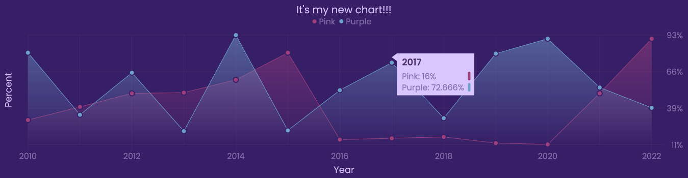
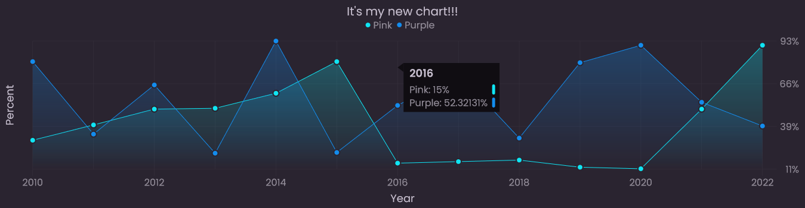
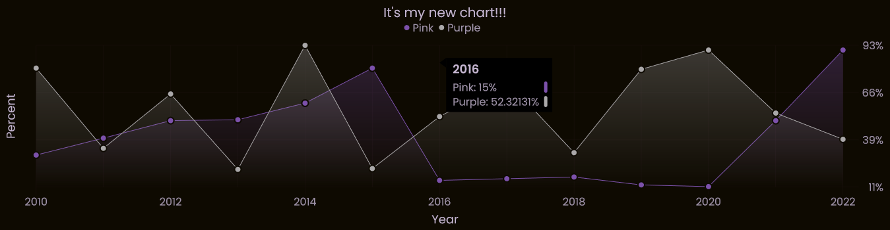
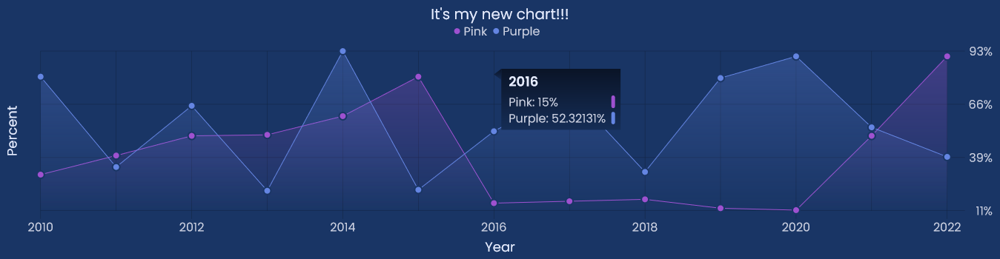
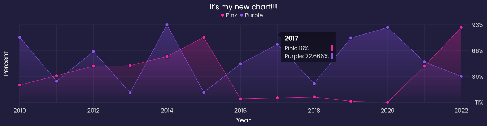
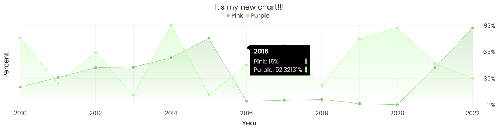

<div align="center">
  <h1>
    <b>Themes</b>
  </h1>
  <p>
    Here is a list of themes that you can apply to your chart
  </p>
</div>

* [Dark](https://github.com/Alexandr-web/Licha/blob/master/.github/themes/readme.md#dark)
* [Light](https://github.com/Alexandr-web/Licha/blob/master/.github/themes/readme.md#light)


We will take this piece of code as a basis, we will only change the parameters of the getTheme method

```js
import { Licha, Utils, } from "licha";

const utils = new Utils();

window.addEventListener("load", () => {
    new Licha({
        selectorCanvas: "canvas",
        theme: utils.getTheme(/** Will only change here */),
        fontFamily: "Poppins",
        blockInfo: {
            groups: {
                gaps: {
                    right: 5,
                    bottom: 10,
                },
            },
            title: { gaps: { bottom: 15, }, },
        },
        legend: {
            circle: { radius: 4, },
            place: "center",
            maxCount: 3,
            gaps: {
                circle: { right: 5, },
                group: {
                    right: 8,
                    bottom: 5,
                },
                legend: { bottom: 15, },
            },
        },
        title: {
            font: {
                text: "It's my new chart!!!",
                size: 20,
                weight: 400,
            },
            gaps: { bottom: 10, },
            place: "center",
        },
        axisX: {
            font: { showText: true, },
            ignoreNames: (n, i) => i % 2 !== 0,
            title: {
                font: {
                    text: "Year",
                    weight: 400,
                },
                gaps: { top: 15, },
            },
        },
        axisY: {
            font: { showText: true, },
            place: "right",
            step: 4,
            title: {
                font: {
                    weight: 400,
                    text: "Percent",
                },
                gaps: { right: 15, },
            },
            editValue: (val) => val + "%",
        },
        grid: {
            line: {
                width: 0.5,
                stretch: true,
            },
        },
        cap: {
            format: "circle",
            size: 5,
            stroke: { width: 2, },
        },
        data: {
            "Pink": {
                data: [
                    { name: 2010, value: 30, },
                    { name: 2011, value: 40, },
                    { name: 2012, value: 50, },
                    { name: 2013, value: 50.5142, },
                    { name: 2014, value: 60, },
                    { name: 2015, value: 80, },
                    { name: 2016, value: 15, },
                    { name: 2017, value: 16, },
                    { name: 2018, value: 17, },
                    { name: 2019, value: 12.321, },
                    { name: 2020, value: 11.3222, },
                    { name: 2021, value: 50, },
                    { name: 2022, value: 90.332131, }
                ],
            },
            "Purple": {
                data: [
                    { name: 2010, value: 80, },
                    { name: 2011, value: 34, },
                    { name: 2012, value: 65.2321, },
                    { name: 2013, value: 21.5142, },
                    { name: 2014, value: 93, },
                    { name: 2015, value: 22, },
                    { name: 2016, value: 52.32131, },
                    { name: 2017, value: 72.666, },
                    { name: 2018, value: 31.4211, },
                    { name: 2019, value: 79.321, },
                    { name: 2020, value: 90.3222, },
                    { name: 2021, value: 54.321, },
                    { name: 2022, value: 39.332131, }
                ],
            },
        },
    }).init();
});
```

## Dark

### Number 0


### Number 1


### Number 2


### Number 3


### Number 4


### Number 5


### Number 6


### Number 7


### Number 8


### Number 9


### Number 10


### Number 11


### Number 12


### Number 13


### Number 14


### Number 15


### Number 16


### Number 17


### Number 18


### Number 19


### Number 20


### Number 21


### Number 22


### Number 23


### Number 24


## Light

### Number 0


### Number 1


### Number 2


### Number 3


### Number 4
