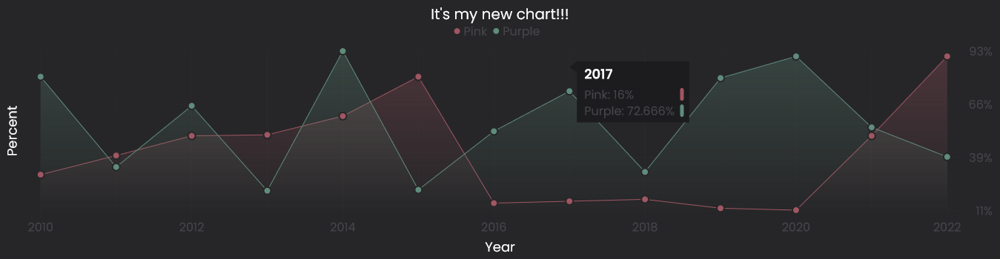
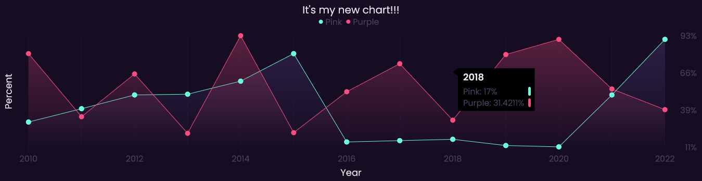
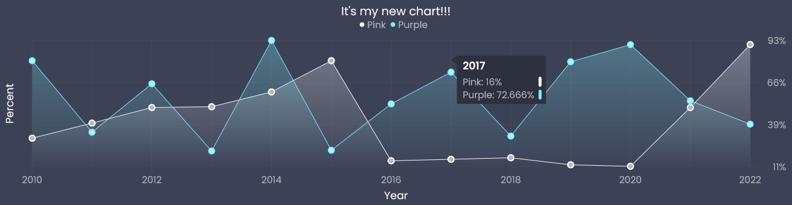
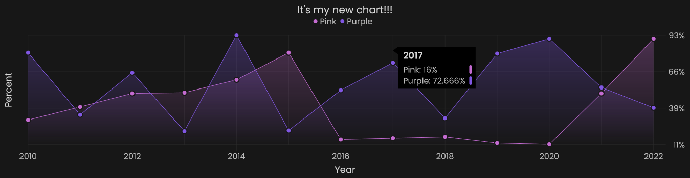
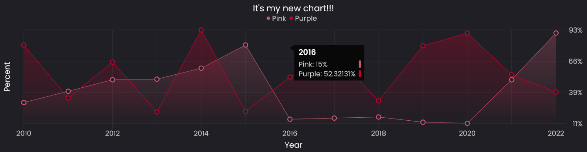
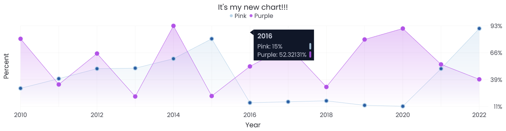
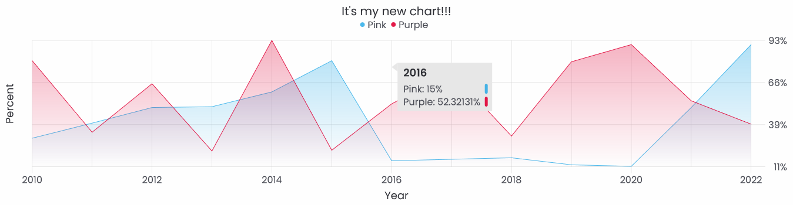

<div align="center">
  <h1>
    <b>Themes</b>
  </h1>
  <p>
    Here is a list of themes that you can apply to your chart
  </p>
</div>

* [Dark](https://github.com/Alexandr-web/aCharty/tree/documentation/.github/themes#dark)
* [Light](https://github.com/Alexandr-web/aCharty/tree/documentation/.github/themes#light)


We will take this piece of code as a basis, we will only change the parameters of the getTheme method

```js
new ACharty({
  theme: utils.getTheme(/** Will only change here */),
  padding: { left: 20, },
  selectorCanvas: "canvas",
  title: {
    font: {
      size: 19,
      text: "Title",
    },
    gapBottom: 10,
  },
  blockInfo: {
    padding: {
      top: 10,
      left: 10,
      bottom: 10,
      right: 10,
    },
    title: {
      font: { size: 16, },
      gaps: { bottom: 20, },
    },
    groups: {
      font: { size: 12, },
      gaps: { bottom: 10, right: 10, },
    },
  },
  legend: {
    font: { size: 16, },
    circle: { radius: 4, },
    gaps: {
      circle: { right: 8, },
      group: { right: 8, bottom: 10, },
      legend: { bottom: 10, },
    },
  },
  axisX: {
    font: { size: 16, },
    title: {
      font: { size: 18, text: "Days", },
      gapTop: 25,
    },
  },
  axisY: {
    font: { size: 16, },
    step: 3,
    title: {
      font: {
        size: 18,
        text: "Sold",
      },
      gapRight: 25,
    },
    editValue: (val) => new Intl.NumberFormat("ru-RU", { style: "currency", currency: "RUB", maximumSignificantDigits: 1, }).format(val),
  },
  cap: {
    format: "square",
    size: 10,
    stroke: { width: 2, },
  },
  grid: {
    line: {
        width: 1,
        dotted: true,
    },
    format: "horizontal", 
  },
  line: { width: 3, },
  data: {
    "Group 1": {
      cap: { format: "circle", size: 6, },
      data: [
        { name: "Monday", value: 100_000, },
        { name: "Tuesday", value: 50_000, },
        { name: "Wednesday", value: 10_000, },
        { name: "Thuesday", value: 35_000, },
        { name: "Friday", value: 5000, },
        { name: "Saturday", value: 50_000, },
        { name: "Sunday", value: 32_000, }
      ],
    },
    "Group 2": {
      data: [
        { name: "Monday", value: 5000, },
        { name: "Tuesday", value: 1200, },
        { name: "Wednesday", value: 41_000, },
        { name: "Thuesday", value: 23_999.4121, },
        { name: "Friday", value: 5000.42141, },
        { name: "Saturday", value: 16_000, },
        { name: "Sunday", value: 8400, }
      ],
    },
  },
}).init();
```

## Dark

### Number 0


### Number 1


### Number 2


### Number 3


### Number 4


### Number 5


### Number 6


### Number 7


### Number 8


### Number 9


### Number 10


### Number 11


### Number 12


### Number 13


### Number 14


### Number 15


### Number 16


### Number 17


### Number 18


### Number 19


### Number 20


### Number 21


### Number 22


### Number 23


### Number 24


## Light

### Number 0


### Number 1


### Number 2


### Number 3


### Number 4
