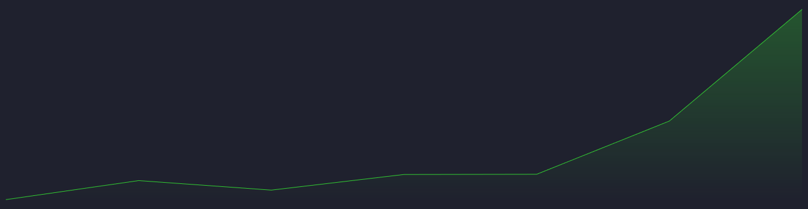
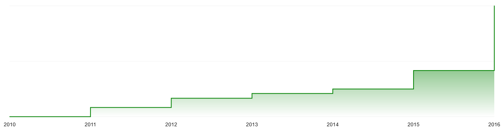
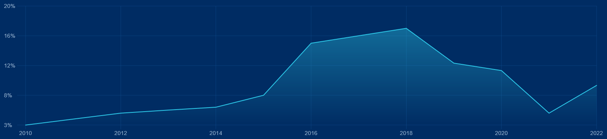
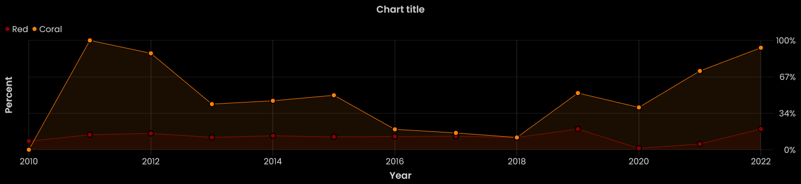
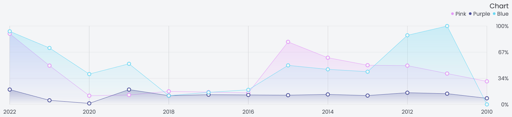

<div align="center">
  <h1>
    <b>Works</b>
  </h1>
  <p>
    Here you can see what this tool is capable of
  </p>
</div>

## Work 1


```js
import { Sinera, Utils, } from "./Sinera";

const utils = new Utils();

new Sinera({
    theme: utils.getTheme(11),
    padding: 10,
    selectorCanvas: "canvas",
    axisX: {
        font: { size: 14, },
        place: "top",
        title: {
            font: {
                size: 16,
                weight: 400,
                text: "Year",
            },
            gaps: { top: 15, },
        },
    },
    cap: {
        format: "circle",
        size: 4,
        stroke: { width: 1, },
    },
    grid: { line: { width: 1, stretch: true, }, },
    data: {
        "Group 1": {
            data: [
                { name: 2010, value: 101_000, },
                { name: 2011, value: 50_000, },
                { name: 2012, value: 10_000, },
                { name: 2013, value: 35_000, },
                { name: 2014, value: 5000, },
                { name: 2015, value: 50_000, },
                { name: 2016, value: 32_000, }
            ],
        },
    },
}).init();
```

## Work 2


```js
import { Sinera, Utils, } from "./Sinera";

const utils = new Utils();

new Sinera({
    theme: utils.getTheme(12),
    padding: 10,
    selectorCanvas: "canvas",
    axisX: {
        font: { size: 14, },
        place: "top",
        title: {
            font: {
                size: 16,
                weight: 400,
                text: "Year",
            },
            gaps: { top: 15, },
        },
    },
    axisY: {
        font: { size: 14, },
        editValue: (val) => new Intl.NumberFormat().format(val),
        step: 4,
        title: {
            font: {
                size: 16,
                weight: 400,
                text: "Sold",
            },
            gaps: { right: 15, },
        },
    },
    cap: {
        format: "circle",
        size: 4,
        stroke: { width: 1, },
    },
    grid: { line: { width: 1, stretch: true, }, },
    data: {
        "Group 1": {
            data: [
                { name: 2010, value: 1, },
                { name: 2011, value: 2, },
                { name: 2012, value: 1.5, },
                { name: 2013, value: 2.32131, },
                { name: 2014, value: 2.3333, },
                { name: 2015, value: 5.132, },
                { name: 2016, value: 10, }
            ],
        },
    },
}).init();
```

## Work 3



```js
import { Sinera, Utils, } from "./Sinera";

const utils = new Utils();

new Sinera({
    padding: 10,
    selectorCanvas: "canvas",
    background: "#1F212E",
    line: {
        color: utils.getColor("limeGreen"),
        width: 1,
        fill: [utils.getColor("limeGreen", 0.3), "transparent"],
    },
    data: {
        "Group 1": {
            data: [
                { name: 2010, value: 1, },
                { name: 2011, value: 2, },
                { name: 2012, value: 1.5, },
                { name: 2013, value: 2.32131, },
                { name: 2014, value: 2.3333, },
                { name: 2015, value: 5.132, },
                { name: 2016, value: 10, }
            ],
        },
    },
}).init();
```

## Work 4


```js
import { Sinera, Utils, } from "./Sinera";

const utils = new Utils();

new Sinera({
    padding: 10,
    selectorCanvas: "canvas",
    background: "#ffffff",
    cap: {
        format: "square",
        size: 7,
    },
    grid: {
        line: {
            width: 1,
            stretch: true,
            color: utils.getColor("white"),
        },
        background: [utils.getColor("whiteSmoke"), utils.getColor("silver", 0.3)],
    },
    data: {
        "Group 1": {
            cap: { color: utils.getColor("limeGreen"), },
            line: {
                color: utils.getColor("limeGreen"),
                width: 1,
                fill: [utils.getColor("limeGreen", 0.3), "transparent"],
            },
            data: [
                { name: 2010, value: 1, },
                { name: 2011, value: 2, },
                { name: 2012, value: 1.5, },
                { name: 2013, value: 2.32131, },
                { name: 2014, value: 2.3333, },
                { name: 2015, value: 5.132, },
                { name: 2016, value: 10, }
            ],
        },
        "Group 2": {
            cap: { color: utils.getColor("fireBrick"), },
            line: {
                color: utils.getColor("fireBrick"),
                width: 1,
                fill: [utils.getColor("fireBrick", 0.3), "transparent"],
            },
            data: [
                { name: 2010, value: 0.351, },
                { name: 2011, value: 9, },
                { name: 2012, value: 7.5, },
                { name: 2013, value: 6.32131, },
                { name: 2014, value: 3.3333, },
                { name: 2015, value: 9.132, },
                { name: 2016, value: 1, },
                { name: 2017, value: 3, },
                { name: 2018, value: 12.321, }
            ],
        },
    },
}).init();
```

## Work 5


```js
import { Sinera, Utils, } from "./Sinera";

const utils = new Utils();

new Sinera({
    padding: 10,
    selectorCanvas: "canvas",
    background: "white",
    axisX: {
        font: {
            size: 14,
            color: utils.getColor("eerieBlack"),
        },
    },
    axisY: {
        font: {
            size: 14,
            color: utils.getColor("eerieBlack"),
        },
        editValue: (val) => val + "k",
        step: 4,
    },
    cap: {
        format: "circle",
        size: 4,
        color: utils.getColor("limeGreen"),
    },
    line: {
        color: utils.getColor("limeGreen"),
        width: 1,
        fill: utils.getColor("limeGreen", 0.3),
    },
    grid: {
        line: {
            width: 1,
            color: utils.getColor("silver", 0.3),
        },
        background: [utils.getColor("whiteSmoke"), utils.getColor("silver", 0.3)],
    },
    data: {
        "Group 1": {
            data: [
                { name: 2010, value: 1, },
                { name: 2011, value: 2, },
                { name: 2012, value: 1.5, },
                { name: 2013, value: 2.32131, },
                { name: 2014, value: 2.3333, },
                { name: 2015, value: 5.132, },
                { name: 2016, value: 10, }
            ],
        },
    },
}).init();
```

## Work 6


```js
import { Sinera, Utils, } from "./Sinera";

const utils = new Utils();

new Sinera({
    padding: 10,
    selectorCanvas: "canvas",
    background: "white",
    legend: {
        circle: { radius: 4, },
        font: {
            size: 16,
            color: utils.getColor("eerieBlack"),
        },
        gaps: {
            circle: { right: 5, },
            group: {
                right: 5,
                bottom: 5,
            },
            legend: { bottom: 10, },
        },
    },
    title: {
        font: {
            size: 18,
            color: utils.getColor("black"),
            weight: 400,
            text: "Activity",
        },
        gaps: { bottom: 15, },
    },
    axisX: {
        font: {
            size: 14,
            color: utils.getColor("eerieBlack"),
        },
    },
    axisY: {
        font: {
            size: 14,
            color: utils.getColor("eerieBlack"),
        },
        editValue: (val) => val + "k",
        step: 4,
    },
    grid: {
        line: {
            width: 1,
            color: utils.getColor("silver", 0.3),
            stretch: true,
        },
        background: utils.getColor("timberwolf", 0.3),
    },
    data: {
        "Group 1": {
            line: { fill: utils.getColor("plum", 0.3), },
            data: [
                { name: 2010, value: 3, },
                { name: 2011, value: 4, },
                { name: 2012, value: 5, },
                { name: 2013, value: 5.5142, },
                { name: 2014, value: 6, },
                { name: 2015, value: 8, },
                { name: 2016, value: 15, }
            ],
        },
        "Group 2": {
            line: { fill: utils.getColor("orangeRed", 0.3), },
            data: [
                { name: 2010, value: 2, },
                { name: 2011, value: 3, },
                { name: 2012, value: 4, },
                { name: 2013, value: 4.5142, },
                { name: 2014, value: 5, },
                { name: 2015, value: 7, },
                { name: 2016, value: 13, }
            ],
        },
        "Group 3": {
            line: { fill: utils.getColor("limeGreen", 0.3), },
            data: [
                { name: 2010, value: 1, },
                { name: 2011, value: 2, },
                { name: 2012, value: 1.5, },
                { name: 2013, value: 2.32131, },
                { name: 2014, value: 2.3333, },
                { name: 2015, value: 5.132, },
                { name: 2016, value: 10, }
            ],
        },
    },
}).init();
```

## Work 7



```js
import { Sinera, Utils, } from "./Sinera";

const utils = new Utils();

new Sinera({
    padding: 10,
    selectorCanvas: "canvas",
    background: "white",
    axisX: {
        font: {
            size: 14,
            color: utils.getColor("eerieBlack"),
        },
    },
    grid: {
        line: { color: utils.getColor("silver", 0.3), },
        format: "horizontal",
    },
    line: {
        width: 2,
        color: utils.getColor("green"),
        fill: [utils.getColor("green"), "transparent"],
        stepped: true,
    },
    data: {
        "Group 1": {
            data: [
                { name: 2010, value: 3, },
                { name: 2011, value: 4, },
                { name: 2012, value: 5, },
                { name: 2013, value: 5.5142, },
                { name: 2014, value: 6, },
                { name: 2015, value: 8, },
                { name: 2016, value: 15, }
            ],
        },
    },
}).init();
```

## Work 8


```js
import { Sinera, } from "./Sinera";

new Sinera({
    padding: 10,
    selectorCanvas: "canvas",
    background: ["#262B62", "#11132C"],
    title: {
        font: {
            size: 18,
            color: "#c2c2c2",
            weight: 400,
            text: "Title chart",
        },
        gaps: { bottom: 15, },
    },
    axisX: {
        font: {
            size: 14,
            color: "#7C81B8",
        },
        rotate: true,
        place: "top",
    },
    grid: { line: { width: 0.5, color: "#5E628B", }, },
    line: { width: 2, },
    cap: {
        format: "circle",
        size: 6,
        stroke: {
            width: 2,
            color: "#11132C",
        },
    },
    data: {
        "Group 1": {
            line: {
                fill: ["rgba(166,61,117,0.4)", "transparent"],
                color: "#A63D75",
            },
            cap: { color: "#A63D75", },
            data: [
                { name: 2010, value: 3, },
                { name: 2011, value: 4, },
                { name: 2012, value: 5, },
                { name: 2013, value: 5.5142, },
                { name: 2014, value: 6, },
                { name: 2015, value: 8, },
                { name: 2016, value: 15, },
                { name: 2017, value: 16, },
                { name: 2018, value: 17, },
                { name: 2019, value: 12.321, },
                { name: 2020, value: 11.3222, },
                { name: 2021, value: 5, },
                { name: 2022, value: 9.332131, }
            ],
        },
        "Group 2": {
            line: {
                fill: ["rgba(9,67,160,0.4)", "transparent"],
                color: "#0943A0",
            },
            cap: { color: "#0943A0", },
            data: [
                { name: 2010, value: 8, },
                { name: 2011, value: 14, },
                { name: 2012, value: 15.2321, },
                { name: 2013, value: 11.5142, },
                { name: 2014, value: 13, },
                { name: 2015, value: 12, },
                { name: 2016, value: 12.32131, },
                { name: 2017, value: 12.666, },
                { name: 2018, value: 11.4211, },
                { name: 2019, value: 19.321, },
                { name: 2020, value: 1.3222, },
                { name: 2021, value: 5.321, },
                { name: 2022, value: 19.332131, }
            ],
        },
    },
}).init();
```

## Work 9



```js
import { Sinera, } from "./Sinera";

new Sinera({
    padding: 10,
    selectorCanvas: "canvas",
    background: "#002C63",
    axisX: {
        font: {
            size: 14,
            color: "#94B0CD",
        },
        ignoreNames: (name, i) => i % 2 !== 0,
    },
    axisY: {
        font: {
            size: 14,
            color: "#94B0CD",
        },
        step: 5,
        editValue: (val) => val + "%",
    },
    grid: {
        line: {
            width: 0.5,
            color: "#115094",
            stretch: true,
        },
    },
    line: { width: 2, },
    data: {
        "Group 1": {
            line: {
                fill: ["rgba(44,200,232,0.4)", "transparent"],
                color: "#2CC8E8",
            },
            data: [
                { name: 2010, value: 3, },
                { name: 2011, value: 4, },
                { name: 2012, value: 5, },
                { name: 2013, value: 5.5142, },
                { name: 2014, value: 6, },
                { name: 2015, value: 8, },
                { name: 2016, value: 15, },
                { name: 2017, value: 16, },
                { name: 2018, value: 17, },
                { name: 2019, value: 12.321, },
                { name: 2020, value: 11.3222, },
                { name: 2021, value: 5, },
                { name: 2022, value: 9.332131, }
            ],
        },
    },
}).init();
```

## Work 10


```js
import { Sinera, } from "./Sinera";

new Sinera({
    padding: 10,
    selectorCanvas: "canvas",
    background: "#262626",
    legend: {
        circle: { radius: 4, },
        font: {
            size: 16,
            color: "#6A6A6A",
        },
        gaps: {
            circle: { right: 5, },
            group: { right: 8, },
            legend: { bottom: 10, },
        },
    },
    title: {
        font: {
            size: 18,
            color: "#6A6A6A",
            weight: 400,
            text: "Title chart",
        },
        gaps: { bottom: 15, },
    },
    axisX: {
        font: {
            size: 14,
            color: "#6A6A6A",
        },
        ignoreNames: (name, i) => i % 2 !== 0,
    },
    axisY: {
        font: {
            size: 14,
            color: "#6A6A6A",
        },
        step: 5,
        editValue: (val) => val + "%",
    },
    grid: {
        line: {
            width: 0.5,
            color: "#5A5A5A",
        },
        format: "vertical",
    },
    line: { width: 2, },
    data: {
        "Group 1": {
            line: { color: ["#404040", "#EFC472", "#BFAA7D"], },
            data: [
                { name: 2010, value: 3, },
                { name: 2011, value: 4, },
                { name: 2012, value: 5, },
                { name: 2013, value: 5.5142, },
                { name: 2014, value: 6, },
                { name: 2015, value: 8, },
                { name: 2016, value: 15, },
                { name: 2017, value: 16, },
                { name: 2018, value: 17, },
                { name: 2019, value: 12.321, },
                { name: 2020, value: 11.3222, },
                { name: 2021, value: 5, },
                { name: 2022, value: 9.332131, }
            ],
        },
        "Group 2": {
            line: { color: ["#5A221F", "#E95851"], },
            data: [
                { name: 2010, value: 8, },
                { name: 2011, value: 14, },
                { name: 2012, value: 15.2321, },
                { name: 2013, value: 11.5142, },
                { name: 2014, value: 13, },
                { name: 2015, value: 12, },
                { name: 2016, value: 12.32131, },
                { name: 2017, value: 12.666, },
                { name: 2018, value: 11.4211, },
                { name: 2019, value: 19.321, },
                { name: 2020, value: 1.3222, },
                { name: 2021, value: 5.321, },
                { name: 2022, value: 19.332131, }
            ],
        },
    },
}).init();
```

## Work 11



```js
import { Sinera, Utils, } from "./Sinera";

const utils = new Utils();

new Sinera({
    padding: 10,
    selectorCanvas: "canvas",
    background: utils.getColor("black"),
    fontFamily: "Poppins",
    legend: {
        circle: { radius: 4, },
        font: { color: utils.getColor("silver"), },
        place: "left",
        maxCount: 2,
        gaps: {
            circle: { right: 5, },
            group: {
                right: 8,
                bottom: 5,
            },
            legend: { bottom: 10, },
        },
    },
    title: {
        font: {
            color: utils.getColor("silver"),
            text: "Chart title",
        },
        gaps: { bottom: 25, },
    },
    axisX: {
        font: { color: utils.getColor("silver"), },
        ignoreNames: (n, i) => i % 2 !== 0,
        title: {
            font: {
                color: utils.getColor("silver"),
                text: "Year",
            },
            gaps: { top: 15, },
        },
    },
    axisY: {
        font: { color: utils.getColor("silver"), },
        place: "right",
        step: 4,
        title: {
            font: {
                color: utils.getColor("silver"),
                text: "Percent",
            },
            gaps: { right: 15, },
        },
        editValue: (val) => val + "%",
    },
    grid: {
        line: {
            width: 0.5,
            color: utils.getColor("onyx"),
            stretch: true,
        },
    },
    cap: {
        format: "circle",
        size: 5,
        stroke: {
            width: 2,
            color: utils.getColor("black"),
        },
    },
    data: {
        "Red": {
            line: {
                fill: utils.getColor("darkRed", 0.1),
                color: utils.getColor("darkRed"),
            },
            cap: { color: utils.getColor("darkRed"), },
            data: [
                { name: 2010, value: 8, },
                { name: 2011, value: 14, },
                { name: 2012, value: 15.2321, },
                { name: 2013, value: 11.5142, },
                { name: 2014, value: 13, },
                { name: 2015, value: 12, },
                { name: 2016, value: 12.32131, },
                { name: 2017, value: 12.666, },
                { name: 2018, value: 11.4211, },
                { name: 2019, value: 19.321, },
                { name: 2020, value: 1.3222, },
                { name: 2021, value: 5.321, },
                { name: 2022, value: 19.332131, }
            ],
        },
        "Coral": {
            line: {
                fill: utils.getColor("coral", 0.1),
                color: utils.getColor("coral"),
            },
            cap: { color: utils.getColor("coral"), },
            data: [
                { name: 2010, value: 0, },
                { name: 2011, value: 100, },
                { name: 2012, value: 88.321, },
                { name: 2013, value: 42.321, },
                { name: 2014, value: 45.321, },
                { name: 2015, value: 50.321, },
                { name: 2016, value: 19, },
                { name: 2017, value: 15.666, },
                { name: 2018, value: 11.4211, },
                { name: 2019, value: 52.321, },
                { name: 2020, value: 39.3222, },
                { name: 2021, value: 72.321, },
                { name: 2022, value: 93.332131, }
            ],
        },
    },
}).init();
```

## Work 12



```js
import { Sinera, Utils, } from "./Sinera";

const utils = new Utils();

new Sinera({
    padding: 10,
    selectorCanvas: "canvas",
    theme: utils.getTheme(2, "light"),
    fontFamily: "Poppins",
    legend: {
        circle: { radius: 4, },
        place: "right",
        maxCount: 3,
        gaps: {
            circle: { right: 5, },
            group: {
                right: 8,
                bottom: 5,
            },
            legend: { bottom: 25, },
        },
    },
    title: {
        font: {
            text: "Chart",
            size: 20,
            weight: 400,
        },
        gaps: { bottom: 10, },
        place: "right",
    },
    axisX: {
        font: { showText: true, },
        sort: "more-less",
        ignoreNames: (n, i) => i % 2 !== 0,
    },
    axisY: {
        font: { showText: true, },
        place: "right",
        step: 4,
        editValue: (val) => val + "%",
    },
    grid: { line: { width: 0.5, }, },
    cap: {
        format: "circle",
        size: 5,
        stroke: { width: 2, },
    },
    data: {
        "Pink": {
            data: [
                { name: 2010, value: 30, },
                { name: 2011, value: 40, },
                { name: 2012, value: 50, },
                { name: 2013, value: 50.5142, },
                { name: 2014, value: 60, },
                { name: 2015, value: 80, },
                { name: 2016, value: 15, },
                { name: 2017, value: 16, },
                { name: 2018, value: 17, },
                { name: 2019, value: 12.321, },
                { name: 2020, value: 11.3222, },
                { name: 2021, value: 50, },
                { name: 2022, value: 90.332131, }
            ],
        },
        "Purple": {
            data: [
                { name: 2010, value: 8, },
                { name: 2011, value: 14, },
                { name: 2012, value: 15.2321, },
                { name: 2013, value: 11.5142, },
                { name: 2014, value: 13, },
                { name: 2015, value: 12, },
                { name: 2016, value: 12.32131, },
                { name: 2017, value: 12.666, },
                { name: 2018, value: 11.4211, },
                { name: 2019, value: 19.321, },
                { name: 2020, value: 1.3222, },
                { name: 2021, value: 5.321, },
                { name: 2022, value: 19.332131, }
            ],
        },
        "Blue": {
            data: [
                { name: 2010, value: 0, },
                { name: 2011, value: 100, },
                { name: 2012, value: 88.321, },
                { name: 2013, value: 42.321, },
                { name: 2014, value: 45.321, },
                { name: 2015, value: 50.321, },
                { name: 2016, value: 19, },
                { name: 2017, value: 15.666, },
                { name: 2018, value: 11.4211, },
                { name: 2019, value: 52.321, },
                { name: 2020, value: 39.3222, },
                { name: 2021, value: 72.321, },
                { name: 2022, value: 93.332131, }
            ],
        },
    },
}).init();
```