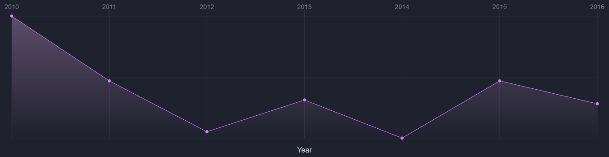
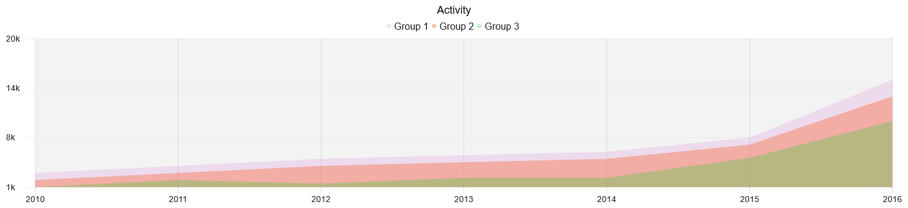

<div align="center">
  <h1>
    <b>Works</b>
  </h1>
  <p>
    Here you can see what this tool is capable of
  </p>
</div>

## Work 1



```js
import { Sinera, Utils, } from "./Sinera";

const utils = new Utils();

new Sinera({
    theme: utils.getTheme(11),
    padding: 10,
    selectorCanvas: "canvas",
    axisX: {
        font: { size: 14, },
        place: "top",
        title: {
            font: {
                size: 16,
                weight: 400,
                text: "Year",
            },
            gaps: { top: 15, },
        },
    },
    cap: {
        format: "circle",
        size: 4,
        stroke: { width: 1, },
    },
    grid: { line: { width: 1, stretch: true, }, },
    data: {
        "Group 1": {
            data: [
                { name: 2010, value: 101_000, },
                { name: 2011, value: 50_000, },
                { name: 2012, value: 10_000, },
                { name: 2013, value: 35_000, },
                { name: 2014, value: 5000, },
                { name: 2015, value: 50_000, },
                { name: 2016, value: 32_000, }
            ],
        },
    },
}).init();
```

## Work 2


```js
import { Sinera, Utils, } from "./Sinera";

const utils = new Utils();

new Sinera({
    theme: utils.getTheme(12),
    padding: 10,
    selectorCanvas: "canvas",
    axisX: {
        font: { size: 14, },
        place: "top",
        title: {
            font: {
                size: 16,
                weight: 400,
                text: "Year",
            },
            gaps: { top: 15, },
        },
    },
    axisY: {
        font: { size: 14, },
        editValue: (val) => new Intl.NumberFormat().format(val),
        step: 4,
        title: {
            font: {
                size: 16,
                weight: 400,
                text: "Sold",
            },
            gaps: { right: 15, },
        },
    },
    cap: {
        format: "circle",
        size: 4,
        stroke: { width: 1, },
    },
    grid: { line: { width: 1, stretch: true, }, },
    data: {
        "Group 1": {
            data: [
                { name: 2010, value: 1, },
                { name: 2011, value: 2, },
                { name: 2012, value: 1.5, },
                { name: 2013, value: 2.32131, },
                { name: 2014, value: 2.3333, },
                { name: 2015, value: 5.132, },
                { name: 2016, value: 10, }
            ],
        },
    },
}).init();
```

## Work 3


```js
import { Sinera, Utils, } from "./Sinera";

const utils = new Utils();

new Sinera({
    padding: 10,
    selectorCanvas: "canvas",
    background: "#1F212E",
    line: {
        color: utils.getColor("limeGreen"),
        width: 1,
        fill: [utils.getColor("limeGreen", 0.3), "transparent"],
    },
    data: {
        "Group 1": {
            data: [
                { name: 2010, value: 1, },
                { name: 2011, value: 2, },
                { name: 2012, value: 1.5, },
                { name: 2013, value: 2.32131, },
                { name: 2014, value: 2.3333, },
                { name: 2015, value: 5.132, },
                { name: 2016, value: 10, }
            ],
        },
    },
}).init();
```

## Work 4


```js
import { Sinera, Utils, } from "./Sinera";

const utils = new Utils();

new Sinera({
    padding: 10,
    selectorCanvas: "canvas",
    background: "#ffffff",
    cap: {
        format: "square",
        size: 7,
    },
    grid: {
        line: {
            width: 1,
            stretch: true,
            color: utils.getColor("white"),
        },
        background: [utils.getColor("whiteSmoke"), utils.getColor("silver", 0.3)],
    },
    data: {
        "Group 1": {
            cap: { color: utils.getColor("limeGreen"), },
            line: {
                color: utils.getColor("limeGreen"),
                width: 1,
                fill: [utils.getColor("limeGreen", 0.3), "transparent"],
            },
            data: [
                { name: 2010, value: 1, },
                { name: 2011, value: 2, },
                { name: 2012, value: 1.5, },
                { name: 2013, value: 2.32131, },
                { name: 2014, value: 2.3333, },
                { name: 2015, value: 5.132, },
                { name: 2016, value: 10, }
            ],
        },
        "Group 2": {
            cap: { color: utils.getColor("fireBrick"), },
            line: {
                color: utils.getColor("fireBrick"),
                width: 1,
                fill: [utils.getColor("fireBrick", 0.3), "transparent"],
            },
            data: [
                { name: 2010, value: 0.351, },
                { name: 2011, value: 9, },
                { name: 2012, value: 7.5, },
                { name: 2013, value: 6.32131, },
                { name: 2014, value: 3.3333, },
                { name: 2015, value: 9.132, },
                { name: 2016, value: 1, },
                { name: 2017, value: 3, },
                { name: 2018, value: 12.321, }
            ],
        },
    },
}).init();
```

## Work 5


```js
import { Sinera, Utils, } from "./Sinera";

const utils = new Utils();

new Sinera({
    padding: 10,
    selectorCanvas: "canvas",
    background: "white",
    axisX: {
        font: {
            size: 14,
            color: utils.getColor("eerieBlack"),
        },
    },
    axisY: {
        font: {
            size: 14,
            color: utils.getColor("eerieBlack"),
        },
        editValue: (val) => val + "k",
        step: 4,
    },
    cap: {
        format: "circle",
        size: 4,
        color: utils.getColor("limeGreen"),
    },
    line: {
        color: utils.getColor("limeGreen"),
        width: 1,
        fill: utils.getColor("limeGreen", 0.3),
    },
    grid: {
        line: {
            width: 1,
            color: utils.getColor("silver", 0.3),
        },
        background: [utils.getColor("whiteSmoke"), utils.getColor("silver", 0.3)],
    },
    data: {
        "Group 1": {
            data: [
                { name: 2010, value: 1, },
                { name: 2011, value: 2, },
                { name: 2012, value: 1.5, },
                { name: 2013, value: 2.32131, },
                { name: 2014, value: 2.3333, },
                { name: 2015, value: 5.132, },
                { name: 2016, value: 10, }
            ],
        },
    },
}).init();
```

## Work 6



```js
import { Sinera, Utils, } from "./Sinera";

const utils = new Utils();

new Sinera({
    padding: 10,
    selectorCanvas: "canvas",
    background: "white",
    legend: {
        circle: { radius: 4, },
        font: {
            size: 16,
            color: utils.getColor("eerieBlack"),
        },
        gaps: {
            circle: { right: 5, },
            group: {
                right: 5,
                bottom: 5,
            },
            legend: { bottom: 10, },
        },
    },
    title: {
        font: {
            size: 18,
            color: utils.getColor("black"),
            weight: 400,
            text: "Activity",
        },
        gaps: { bottom: 15, },
    },
    axisX: {
        font: {
            size: 14,
            color: utils.getColor("eerieBlack"),
        },
    },
    axisY: {
        font: {
            size: 14,
            color: utils.getColor("eerieBlack"),
        },
        editValue: (val) => val + "k",
        step: 4,
    },
    grid: {
        line: {
            width: 1,
            color: utils.getColor("silver", 0.3),
            stretch: true,
        },
        background: utils.getColor("timberwolf", 0.3),
    },
    data: {
        "Group 1": {
            line: { fill: utils.getColor("plum", 0.3), },
            data: [
                { name: 2010, value: 3, },
                { name: 2011, value: 4, },
                { name: 2012, value: 5, },
                { name: 2013, value: 5.5142, },
                { name: 2014, value: 6, },
                { name: 2015, value: 8, },
                { name: 2016, value: 15, }
            ],
        },
        "Group 2": {
            line: { fill: utils.getColor("orangeRed", 0.3), },
            data: [
                { name: 2010, value: 2, },
                { name: 2011, value: 3, },
                { name: 2012, value: 4, },
                { name: 2013, value: 4.5142, },
                { name: 2014, value: 5, },
                { name: 2015, value: 7, },
                { name: 2016, value: 13, }
            ],
        },
        "Group 3": {
            line: { fill: utils.getColor("limeGreen", 0.3), },
            data: [
                { name: 2010, value: 1, },
                { name: 2011, value: 2, },
                { name: 2012, value: 1.5, },
                { name: 2013, value: 2.32131, },
                { name: 2014, value: 2.3333, },
                { name: 2015, value: 5.132, },
                { name: 2016, value: 10, }
            ],
        },
    },
}).init();
```

## Work 7


```js
import { Sinera, Utils, } from "./Sinera";

const utils = new Utils();

new Sinera({
    padding: 10,
    selectorCanvas: "canvas",
    background: "white",
    axisX: {
        font: {
            size: 14,
            color: utils.getColor("eerieBlack"),
        },
    },
    grid: {
        line: { color: utils.getColor("silver", 0.3), },
        format: "horizontal",
    },
    line: {
        width: 2,
        color: utils.getColor("green"),
        fill: [utils.getColor("green"), "transparent"],
        stepped: true,
    },
    data: {
        "Group 1": {
            data: [
                { name: 2010, value: 3, },
                { name: 2011, value: 4, },
                { name: 2012, value: 5, },
                { name: 2013, value: 5.5142, },
                { name: 2014, value: 6, },
                { name: 2015, value: 8, },
                { name: 2016, value: 15, }
            ],
        },
    },
}).init();
```