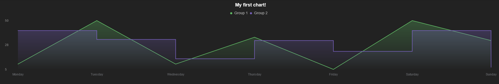

<div align="center">
  <h1>
    <b>aCharty</b>
  </h1>
  <p>
    aCharty is a JavaScript project that will help you build a line chart
  </p>
</div>

## Example
```javascript
new ACharty({
  selectorCanvas: "canvas",
  background: "#222222",
  legend: {
    font: {
      color: "#c2c2c2",
      size: 14,
      weight: 400,
    },
    circle: { radius: 4, },
    gaps: {
      circle: { right: 8, },
      group: { right: 8, bottom: 10, },
      legend: { bottom: 10, },
    },
    maxCount: 2,
  },
  axisX: {
    font: {
      size: 12,
      color: "#67696D",
    },
  },
  title: {
    font: {
      text: "My first chart!",
      size: 18,
      color: "white",
      weight: 600,
    },
    gapBottom: 10,
  },
  axisY: {
    font: {
      size: 12,
      color: "grey",
      weight: 400,
    },
    step: 3,
  },
  line: { width: 2, color: "#61BE66", fill: ["rgba(97,190,102,0.3)", "transparent"], },
  data: {
    "Group 1": {
      data: [
        { name: "Monday", value: 10, },
        { name: "Tuesday", value: 50, },
        { name: "Wednesday", value: 10, },
        { name: "Thursday", value: 35, },
        { name: "Friday", value: 5, },
        { name: "Saturday", value: 50, },
        { name: "Sunday", value: 32, }
      ],
    },
    "Group 2": {
      line: { color: "rgb(120,97,190)", fill: ["rgba(120,97,190,0.3)", "transparent"], stepped: true, },
      data: [
        { name: "Monday", value: 41, },
        { name: "Tuesday", value: 33, },
        { name: "Wednesday", value: 15, },
        { name: "Thursday", value: 32, },
        { name: "Friday", value: 22, },
        { name: "Saturday", value: 41, },
        { name: "Sunday", value: 7, }
      ],
    },
  },
}).init();
```

## Result
