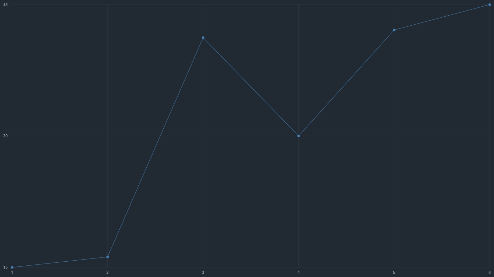

# aCharty

Creating simple graphs

## Usage

  ### HTML
  ```html
  <canvas class="canvas"></canvas>
  ```

  ### JS
  ```js
  new ACharty({
    canvasSelector: ".canvas",
    background: "#212932",
    axisX: {
      line: {
        width: 1,
        color: "#2E353F",
      },
      color: "#A1ABB4",
      fontSize: 12,
      showText: true,
    },
    axisY: {
      line: {
        width: 1,
        color: "#2E353F",
      },
      color: "#A1ABB4",
      fontSize: 12,
      showText: true,
    },
    cap: { radius: 4, },
    data: {
      "My group 1": {
        line: { color: "#4781B4", },
        cap: { color: "#4781B4", },
        data: [
          { name: "1", value: 15, },
          { name: "2", value: 16.2, },
          { name: "3", value: 41.23, },
          { name: "4", value: 30, },
          { name: "5", value: 42.1, },
          { name: "6", value: 45, }
        ],
      },
    }
  }).init();
  ```

  ### Result
  

<center>
  <h1>Documentation</h1>
</center>

## canvasSelector (`string`)
A selector by which to refer to your canvas element

### HTML
```html
  <canvas class="canvas"></canvas>
```

### JS
```js
new ACharty({ canvasSelector: ".canvas" }).init();
```

## background (`string`)
Graph background

### JS
```js
new ACharty({ background: "white" }).init();
new ACharty({ background: "#ffffff" }).init();
new ACharty({ background: "rgba(255, 255, 255, 1)" }).init();
```

## data (`object`)
Contains groups of data that will be displayed on the chart

### JS
```js
new ACharty({
  data: {
    "Group 1": {
      data: [
        { name: "1", value: 15, },
        { name: "2", value: 16.2, },
        { name: "3", value: 41.23, },
        { name: "4", value: 30, },
        { name: "5", value: 42.1, },
        { name: "6", value: 45, }
      ],
    },
  },
}).init();
```

## line (`object`)
Contains common styles for chart lines

### JS
```js
new ACharty({
  line: {
    color: "green",
    width: 3,
  },
}).init();
```

## cap (`object`)
Contains common styles for line caps

### JS
```js
new ACharty({
  cap: {
    radius: 3,
    color: "green",
    stroke: {
      width: 2,
      color: "black",
    },
  },
}).init();
```

## axisX (`object`)
Contains styles for elements belonging to the x-axis

### JS
```js
new ACharty({
  axisX: {
    line: {
      width: 1,
      color: "#2E353F",
    },
    color: "#A1ABB4",
    fontSize: 12,
    showText: true,
  },
}).init();
```

## axisY (`object`)
Contains styles for elements belonging to the y-axis

### JS
```js
new ACharty({
  axisY: {
    line: {
      width: 1,
      color: "#2E353F",
    },
    color: "#A1ABB4",
    fontSize: 12,
    showText: true,
  },
}).init();
```

## updateWhenResizing (`boolean`)
If true, then when the screen size changes, the graph will be updated. True by default

### JS
```js
new ACharty({ updateWhenResizing: false }).init();
```

## padding (`object`)
Contains the padding object inside the chart. By default, all are set to 10

### JS
```js
new ACharty({
  padding: {
    top: 25,
    right: 25,
    bottom: 25,
    left: 25,
  },
}).init();
```