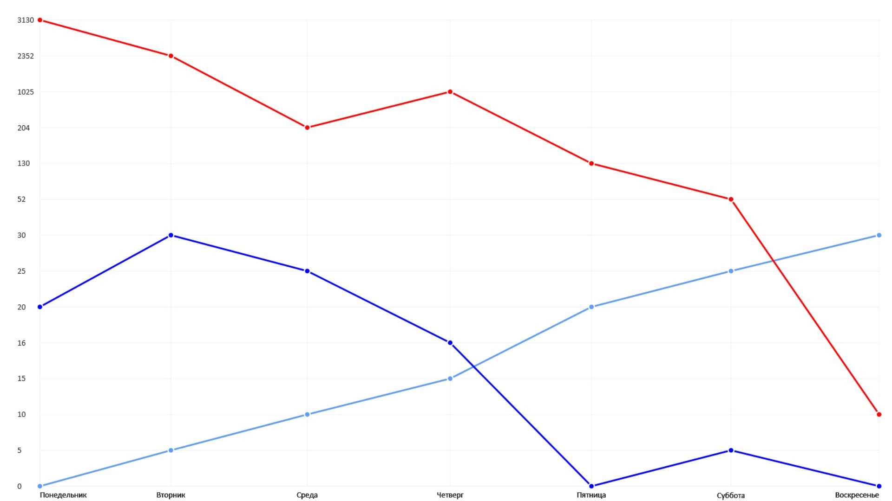

# MyChart

## Example

### HTML
```html
<canvas class="canvas"></canvas>
```

### JS

```js
const myChart = new Chart({
  canvasSelector: ".canvas",
  background: "#222222",
  axisY: {
    line: {
      color: "#c2c2c2",
      width: 1,
    },
    color: "white",
    fontSize: 12,
  },
  axisX: {
    line: {
      color: "#c2c2c2",
      width: 1,
    },
    color: "white",
    fontSize: 10,
  },
  line: {
    color: "#CC397B",
    width: 3,
  },
  cap: {
    color: "#222222",
    radius: 5,
    stroke: {
      color: "#CC397B",
      width: 2,
    },
  },
  data: [
    { name: "Name 1", value: 0, },
    { name: "Name 2", value: 100, },
    { name: "Name 3", value: 20, },
    { name: "Name 4", value: 50, },
    { name: "Name 5", value: 0, },
  ],
}).init();
```

### Result


## You can also change the chart data and update it to render

```js
const myChart = new Chart({ ... }).init();

setTimeout(() => {
  // Removing 1 element
  myChart.data.splice(0, 1);
  // Redrawing
  myChart.update();
}, 1000);
```